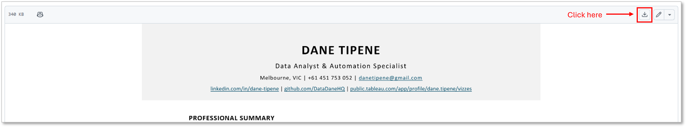

# Resume

Data Analyst specialising in automation and regulatory analytics. Track record building systems that eliminate weeks of manual work:

- 🤖 **Automation**: Reduced 12+ day validation processes to <2 days
- 📊 **Reporting**: Engineered 5,000+ line system reducing 30+ day workflows to 10 minutes  
- 🚀 **Innovation**: Led organisation's first generative AI implementation
- 📈 **Impact**: Freed hundreds of analyst hours for strategic work

**Technical Stack**: R | Python | SQL | Tableau | Azure SQL | Machine Learning

 

* [Click here to view the PDF](Documents/Resume%20-%20Dane%20Tipene%202025-26.pdf)

To download the PDF, click the download button as shown on the PDF preview page. 

> *Last updated: March 2026*
